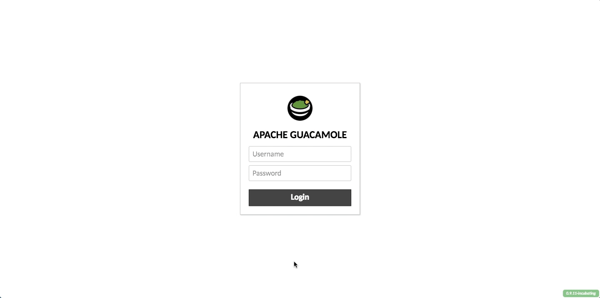

# Module 0: Access your Docker Lab Development Box

If you decided not to follow along with this lab on your local host with docker pre-installed, you can gain access to your cloud hosted student development box for development. This VM comes pre-installed with Docker and all dependencies required to complete this lab. 

This module will be used at ServTech 2017 for TechTables. Cloud hosted resources will **only** available during the alloted Session time slots. 

# Accessing your VM

1. Navigate to [https://portal.sl.americasreadiness.com](https://portal.sl.americasreadiness.com) to access your HTML5 bsed VM console through [Guacamole](https://vimeo.com/116207678).

2. Logon using your username and password : 
    * **Username:** User**X**
    * **Password:** XXXXXX (given out at the time of session)

    > **X** in 'UserX' corresponds to your student number (1 through 7). For example, if you are student 1, you will logon with username `user1` and password `Password01`. 

3. You will enter directly into a CLI interface of an Ubuntu Docker host which you will use to learn more about docker. A few things to note about the HTML5 based console: 
	
    * If you need to change input methods to copy and paste text into the CLI, press the keys: `alt  ` + `ctrl` + `shift` to toggle the side pane. 
    * You can select  **None** which directly translates keyboard inputs into the CLI
    * You can select **Text Input** for a text form field entry to copy and paste large amounts of text. 
    * You can also select **On-Screen Keyboard** if you are on a tablet or touch screen device   without a proper keyboard input device. 
    * Be sure to use the **Clipboard** text box on the left. If you would like to paste text into   the console, somply **right click into the CLI screen**. 
  
# Demonstration 

# Shortcuts

1. [Module 0-A: Install Docker Locally](https://hub.docker.com/?next=https%3A%2F%2Fhub.docker.com%2F)
2. [Module 1: Running Docker Containers](../Module-1)
3. [Module 2: Creating Custom Images from Dockerfiles](../Module-2)
4. [Module 3: Using Docker Compose](../Module-3)

