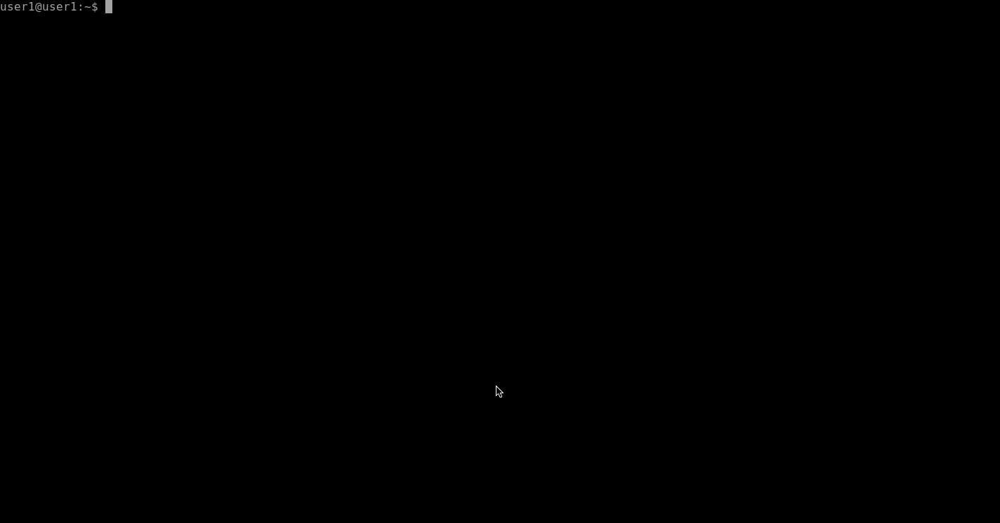

# Pulling from Docker Hub

Before any container is run, a local copy of the image is always stored locally on the host. In this exercise we will pull a docker image from docker hub onto the docker host. 

### Step 1

To pull an image down locally onto a host, run the following command: 

`docker pull mayankt/webserver:a`

Here is a break down of the command as follows: 

  * `docker pull`: Is a docker command that tells docker engine to pull an image down frosomewher
  * `mayankt/webserver:a`: Is the image name. By default, if a full fqnd is not specified, iis assumed you are pulling the image from docker hub. In this case, you will be pulling aimage from my repository [mayankt](https://hub.docker.com/r/mayankt/webserver/) with aimage titles `webserver` whith the tag of `a`. 

    * Tagging images can help with versioning of your docker images and many other use cases as well. 

 Once you run the command you should see an output similar to this: 

```
Pulling from mayankt/webserver
3ac0c2aa6889: Pull complete 
ec2ec713dc4f: Pull complete 
ea0a5af9851c: Pull complete 
555bf6439b47: Pull complete 
71080d75d6eb: Pull complete 
c787ac6d0b0a: Pull complete 
1a9841bc3a47: Pull complete 
1a7ce5d6010a: Pull complete 
eec46f0642a8: Pull complete 
d2d3a856c0da: Pull complete 
f128b2a739b4: Pull complete 
1341f98ff817: Pull complete 
```
Which indicates that the image is being pulled from docker hub locally onto your docker host. 

### Step 2

Type the following command to see a list of all images stored locally on your host.

`docker images`

Your output should resemble : 

```
REPOSITORY          TAG                 IMAGE ID            CREATED             SIZE
mayankt/webserver   a                   18f05d0cd921        2 months ago        27.9MB
```

This output shows a 27.9 MB large docker image stored locally that can be run into instances of docker containers. All the `f128b2a739b4: Pull complete` outputs from the `docker pull` command above are the layers being pulled from Docker Hub of which constitute the `mayankt/webserver:a` docker image.

### Conclusion

A simple `docker pull < image-name > ` commands shows how you can pull a docker image from the cloud directly. It's not used until you run a container with it which we will do in the [next Exercise](../Exercise-2).



### Shortcuts

1. [Module 0-A: Install Docker Locally](https://hub.docker.com/?next=https%3A%2F%2Fhub.docker.com%2F)
2. [Module 0-B: Access your Docker Lab Development Box](../../Module-0)
2. [Module 1: Running Docker Containers](../../Module-1)
3. [Module 2: Creating Custom Images from Dockerfiles](../../Module-2)
4. [Module 3: Using Docker Compose](../../Module-3)
