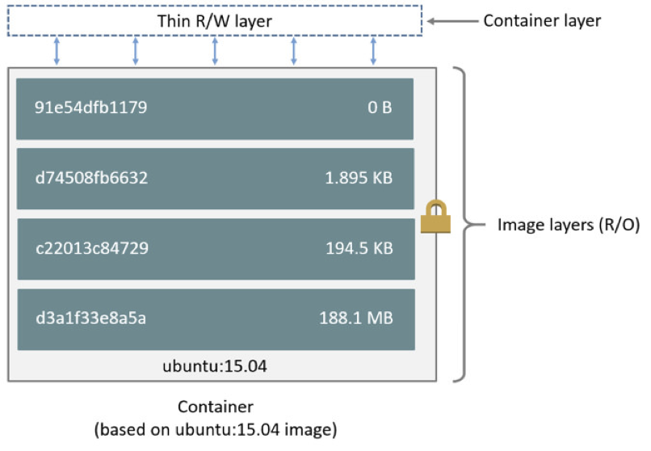

# Module 1: Running Docker Containers

Once you have Docker installed locally or have gained access to the sandbox host, you can verify your installation by simply typing `docker --version` to see an output similar to: 

```
Docker version 17.06.0-ce, build 02c1d87
```
  > If you get a permissions errors on your local docker machine, type `sudo docker --version` to complete the task. The current user must be in [sudoers or docker group](https://docs.docker.com/engine/installation/linux/linux-postinstall/) to execute docker commands. 

## Docker Images 

All Docker containers are based off [Docker images](https://docs.docker.com/engine/userguide/storagedriver/imagesandcontainers/). Docker images are built up from a series of layers. Each layer represents an instruction or resulting block storage changes to the container's filesystem. Each layer except the very last one is read-only, so once an image is made, any changes to data in a running container are made on a separate R/W layer. Think of it as application layering where the first image layer is always a blank minimalistic starting block from [scratch](https://hub.docker.com/_/scratch/) and changes are done by installing dependencies or applications that you desire to package with your docker image. See the visual below to illustrate the concept of image layering: 



You can store docker images in several places: 

  1. [Docker Hub](https://hub.docker.com/explore/)
  2. [Other Public Repositories](https://quay.io/tour/)
  3. [Locally on your machine](http://blog.thoward37.me/articles/where-are-docker-images-stored/)
  4. [Private Docker registries](https://docs.docker.com/registry/deploying/#storage-customization)
  5. [In a tar archive](https://docs.docker.com/engine/reference/commandline/save/)

 We will mainly be concerning ourselves with **#1** pulling images from Docker Hub.

## Exercises 

Navigate to and complete the following exercises within **Module 1**.

1. [Pulling from Docker Hub](./Exercise-1)
2. [Running a Container](./Exercise-2)

# Reset the Sandbox Environment 

Once you have completed **Module 1**, reset the environment by typing in the following command in your sandbox environment: 

`sudo /dockerclean.sh`

If you are following along on your local machine, enter the following commands to remove all docker containers, images, and docker volumes from your host: 

```
docker kill $(docker ps -q)
docker rm -f $(docker ps -a -q)
docker rmi $(docker images -q)
docker volume rm $(docker volume ls -qf)
```

### Shortcuts

1. [Module 0-A: Install Docker Locally](https://hub.docker.com/?next=https%3A%2F%2Fhub.docker.com%2F)
2. [Module 0-B: Access your Docker Lab Development Box](../Module-0)
2. [Module 1: Running Docker Containers](../Module-1)
3. [Module 2: Creating Custom Images from Dockerfiles](../Module-2)
4. [Module 3: Using Docker Compose](../Module-3)
