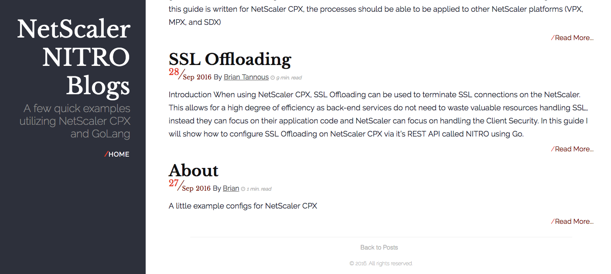
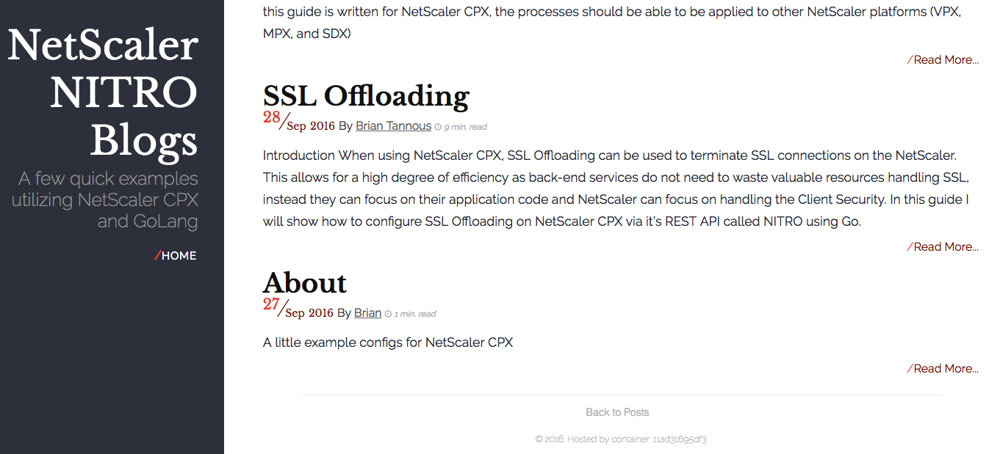

# Run a Docker Container

In this exercise we will create a two docker containers from two new images we created in the [previous exercise](../Exercise-1). We will also create a third container that uses volume mounts to share persistent data with the docker host. 

### Step 1 

Lets run our first container based off the image we created from the [GoLang-cpx](https://github.com/Citrix-TechSpecialist/GoLang-cpx/) repository. Enter the following command to run your docker container: 

`docker run -dt --name=cpx-blog-1 -p 10000:80 cpx-blog`
 
 Here is the breakdown of the command: 

* `docker run -dt` 
    * This will run the container detached with a terminal in the background. Later we will see how we can attach to this container's CLI, but for now we will have the container running detached in the background as a daemon. 

* `--name=cpx-blog-1`
    * This gives the container a name for more intuitive reference in later docker commands. Without a name parameter, the container will be randomly assigned a name and can be referenced to via the random name or the hash id of the container. 

* `-p 10000:80` 
    * This will expose port `10000` on the host and map it to port `80` on the container for access to the hosted website.

* `cpx-blog`
    * This identifies the image we want to use by the docker engine to base our container off of. It will not bother pulling from Dockerhub because the image is already stored locally given you have completed [exercise 1](../Exercise-1).

You should receive an output of a long UID as a reference to the running container similar to `
ed2348b56eda197a90313c8876ab4e6601b52406ba1c6740ccccd6e996565f60`

You can view the running container by entering in the `docker ps` command: 
```
CONTAINER ID        IMAGE               COMMAND                  CREATED              STATUS              PORTS                   NAMES
ed2348b56eda        cpx-blog            "/bin/sh -c '/usr/..."   About a minute ago   Up About a minute   0.0.0.0:10000->80/tcp   cpx-blog-1
```

Now lets view the website hosted by our docker container. If you are following along on your local machine, go to url [http://localhost:10000](http://localhost:10000).

If you are following along in the sandbox environment, navigate your local browser to [http://userX-lb.sl.americasreadiness.com](http://userX-lb.sl.americasreadiness.com) where `X` denotes your user number in the FQDN. 

On the website, scroll down to the very bottom to notice the footer of this page stating: *2016. All rights reserved.* Make a note of this, because we are now going to run our new container that will have updated footer information. 



Lastly, lets remove this container so we can recycle the host port `10000` for our new container. 

`docker rm -f cpx-blog-1`

### Step 2

Lets run our second container based off the image we created from the modified version of the Dockerfile in the [GoLang-cpx](https://github.com/Citrix-TechSpecialist/GoLang-cpx/) repository. Enter the following command to run your docker container: 

`docker run -dt --name=cpx-blog-2 -p 10000:80 cpx-blog:v2`

You can view the running container by entering in the `docker ps` command: 
```
CONTAINER ID        IMAGE               COMMAND                  CREATED              STATUS              PORTS                   NAMES
6e115d1c21f5        cpx-blog:v2            "/bin/sh -c '/usr/..."   About a minute ago   Up About a minute   0.0.0.0:10000->80/tcp   cpx-blog-2
```

Now lets view the updated website hosted by our new docker container. If you are following along on your local machine, go to url [http://localhost:10000](http://localhost:10000).

If you are following along in the sandbox environment, navigate your local browser to [http://userX-lb.sl.americasreadiness.com](http://userX-lb.sl.americasreadiness.com) where `X` denotes your user number in the FQDN. 

On the website, scroll down to the very bottom and notice the footer of this page stating: *2016. Hosted by container: **11ad31695df3**.* The container hostname is showing up because of the `/tmp/update.sh` script that was executed when the container was run to update all `.html` footer code as defined in our new Dockerfile.


 
Lastly, lets remove this container so we can recycle the host port `10000` for our new container. 

`docker rm -f cpx-blog-2`

### Step 3

Thus far we have seen the docker container host the website with the `.html` data local to it's file system. Ideally, you would not want to store any persistent data on the container itself, rather you should store in on some network or hyperconverged storage solution that the container can access as if local instead. This allow you to de-coupling storage of persistent data in the container from the compute processing done by the container itself and allows you to be more agile, spreads your failure domain, and scale independently in storage and compute capacity. 

In this In this step, we will run the same container as in **step 1**, but with a volume mount that shares a directory with the docker host mounted in the container to share persistent data. Enter the following command to run a docker container with a [volume mount](https://docs.docker.com/engine/reference/run/#volume-shared-filesystems).

`docker run -dt --name=cpx-blog-3 -p 10000:80 -v /data/GoLang-cpx/cpx-blog:/www:rw cpx-blog` 

Here is the breakdown of the new volume mount `-v` flag in the `docker run` command: 

* `-v /data/GoLang-cpx/cpx-blog:/www:rw`
    * The `-v` flag denotes that this container will have a volume mount that is located on the local host at `/data/GoLang-cpx/cpx-blog` and that directory will be mapped to the `/www` directory that is local to the container. The container will have *read/write* permissions to this directory as denoted by the `:rw` at the end. 

    * This allows us to remove the `COPY ./cpx-blog /www` command form our Dockerfile if desired to. However the pre-requisite of this container would become that a volume mount be provided at run time to host whatever content is in the mounted `/www` directory local to the container.. 

    * Adding volume mounts of persistent data to containers saves space as well, because now the data isn't replicated in each container, rather multiple containers can instead reference the same volume mount on a NFS network share, for example, mounted on the local docker host.

    * Other services can also independently manipulate data in the volume mount directory on the host that have read-write access and it can be reflected in the running cpx-blog containers for example. 

Once you have your container running, lets view the site hosted by our new docker container. If you are following along on your local machine, go to url [http://localhost:10000](http://localhost:10000).

If you are following along in the sandbox environment, navigate your local browser to [http://userX-lb.sl.americasreadiness.com](http://userX-lb.sl.americasreadiness.com) where `X` denotes your user number in the FQDN. 

You will notice that the site looks identical to it did in **Step 1**. Lets change some content to the title page to prove a point. 

Enter the following command to edit text in the `index.html` of the home page of the blog: 

`sudo nano /data/GoLang-cpx/cpx-blog/index.html`

Scroll down into the file where you see the line: 

```
<h1 class="brand-title">NetScaler NITRO Blogs</h1>
```

update that line to look like : 

```
<h1 class="brand-title">LEARN DOCKER!</h1>
```

Save and quit `nano` by entering the keys `ctrl` + `x` then `y` and `enter`. 

Now refresh your browser to the blog to view the updates changes. You should see a new title in the home page reflecting your changes to the `index.html`

Lastly, lets remove this container so we can recycle the host port `10000` for subsequent Modules. 

`docker rm -f cpx-blog-3`

### Conclusion 

In this module, we ran a container hosting our website using a Dockerfile in the [GoLang-cpx](https://github.com/Citrix-TechSpecialist/GoLang-cpx/) repository. We also ran a container that has a script that ran at runtime to dynamically update the footer on each webpage to display the container's hostname. Lastly, we deployed a third container that hosted the webpage through a volume mount where the data of the website only resided on the host and we showed that the data could be independently manipulated to reflect updates on our container hosted website. 

Here is an overview of the previous 3 steps. 


### Shortcuts

1. [Module 0-A: Install Docker Locally](https://hub.docker.com/?next=https%3A%2F%2Fhub.docker.com%2F)
2. [Module 0-B: Access your Docker Lab Development Box](../../Module-0)
2. [Module 1: Running Docker Containers](../../Module-1)
3. [Module 2: Creating Custom Images from Dockerfiles](../../Module-2)
4. [Module 3: Using Docker Compose](../../Module-3)
